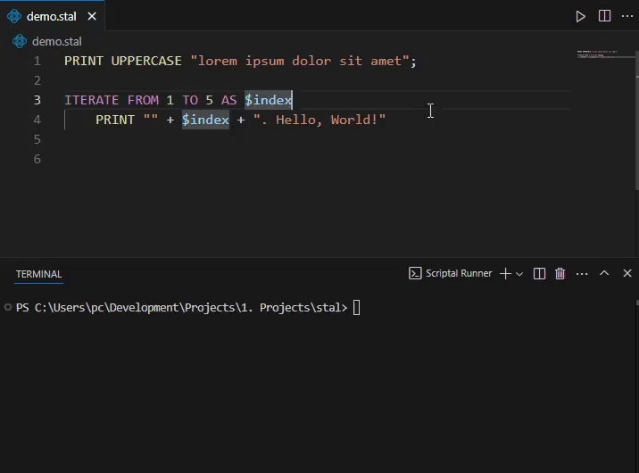

## Scriptal Runner for Visual Studio Code

Scriptal Runner is a Visual Studio Code extension for [Scriptal programming language](https://github.com/martin-amaro/Scriptal) that allows you to execute Scriptal code directly within the editor. Run your .stal scripts seamlessly without leaving VS Code.

## Requirements
- [Scriptal 1.0](https://www.github.com/martin-amaro/Scriptal/releases/latest) (Windows Only)

## Installation

1. Open Visual Studio Code.
2. Go to the **Extensions** view by clicking on the Extensions icon in the Activity Bar.
3. Search for **"Scriptal Runner"** and install the extension.

## Usage

- Open a **.stal** file.
- Run the script using the integrated **Scriptal Runner**.

## Contributing

If you would like to contribute to this extension, please submit a pull request or open an issue.

## License

This extension is licensed under the MIT License.
